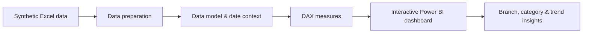

# Retail Sales Performance Dashboard

**Power BI | DAX | Data Modeling | Retail Analytics | Business Insights**

A self-directed Power BI portfolio project exploring how a multi-branch retailer can monitor sales performance, compare locations and product categories, identify trends and turn transactional data into readable business insights.

**Dataset:** Synthetic / illustrative retail sales data — **45 Jeddah branches, June–August 2026**.  
**Project type:** Personal data analytics and visualization project; **not an official employer report**.  
**Working report:** `SalesDashboard.pbix` (the latest report supplied by the project creator).

> All dataset values, branch identifiers and dashboard conclusions should be interpreted as synthetic examples, not real company sales, employee performance or verified commercial results.

## Project Overview

Retail sales are often recorded at transaction level, while operational decisions depend on broader questions: How are sales changing over time? Which branches contribute most? What is happening across product categories? Are customer transactions or basket values changing? This project organizes a synthetic retail dataset into a Power BI dashboard designed to make those questions easier to explore.
## Dashboard Preview

### Full Dashboard

### KPI Cards

### Charts & Insights

### Analytical workflow

## Dashboard Features

The supplied Power BI report's visual configuration references the following functionality:

- KPI cards for **Total Sales**, **Total Transactions**, **Total Quantity** and **Avg. Transaction Value**.
- Sales trends and monthly selection.
- Branch comparison and product-category sales analysis.
- Dynamic text measures for **Best Branch Insight**, **Worst Branch Insight** and **Sales Trend Insight**.
- A sales-change indicator and supporting conditional-color logic.

The report's presentation combines summary KPIs with drill-down views so the active filters influence the interpretation of results.

## Key Performance Indicators

| KPI | Intended business question |
|---|---|
| Total Sales | How much sales value falls within the current selection? |
| Total Transactions | How many distinct transactions were recorded? |
| Total Quantity | How many units were sold? |
| Avg. Transaction Value | What is the average sales value per transaction? |
| Sales Change Indicator | How does the selected period compare with the relevant prior period? |
| Best / Worst Branch Insight | Which illustrative branches lead or trail within the selected context? |
| Sales Trend Insight | What does the selected sales trajectory suggest? |

For the names verified in the report's visual definitions and examples of commonly used DAX patterns, see **[KPI & DAX documentation](docs/kpis-and-dax.md)**. The sample formulas there are *illustrations*: the PBIX model's original expression bodies have not been extracted verbatim.

## Data & Modeling

The original working dataset is an Excel workbook named `Jeddah_Retail_Sales_Synthetic_3M.xlsx`. Its model comprises transaction data and descriptive tables for branches, products and targets. The report uses a date table for time-based analysis. The report also references a `Branch Performance` table for some analytical text and KPI visuals.

| Data component | Purpose |
|---|---|
| `Sales_Raw` | Transaction-level sales, quantities, prices, discounts and transaction IDs |
| `Branches` | Illustrative branch identifiers and descriptions |
| `Products` | Product attributes and categories |
| `Targets` | Synthetic monthly branch targets |
| `DateTable` | Calendar context for month selection and comparisons |
| `Branch Performance` | Referenced in report visuals for some KPIs and insights |

**[Data model and source notes →](docs/data-model.md)**

## Dashboard Design & Business Insights

The report is designed around four layers:

1. **Headline performance:** sales, transactions, units and average transaction value.
2. **Time:** monthly sales trends and changes under the selected date context.
3. **Composition:** sales contribution by product category and branch.
4. **Narrative:** DAX-driven insight text about branch performance and sales direction.

These outputs demonstrate an analytical workflow. They do **not** establish actual branch performance or realized revenue improvements.

**[Dashboard overview →](docs/dashboard-overview.md)**

## Skills Demonstrated

**Power BI · DAX · Data Modeling · Business Intelligence · KPI Design · Sales Analysis · Data Visualization · Interactive Filtering · Business Insight Communication**

## Repository Contents

| Resource | What it covers |
|---|---|
| [Dashboard overview](docs/dashboard-overview.md) | Business question, analysis and report structure |
| [Data model](docs/data-model.md) | Synthetic source, table roles and conceptual relationships |
| [KPI and DAX documentation](docs/kpis-and-dax.md) | Measures referenced by visuals and labeled example DAX |

### Power BI file and dashboard screenshots

The working PBIX file and Excel source are available in the project creator's working files, but **the binary files are not yet attached to this GitHub repository**. This page deliberately avoids nonfunctional download links or presenting an older dashboard screenshot as an export of the current `SalesDashboard.pbix`. Once the final sanitized binary files are uploaded, the direct links and actual report screenshots can be added here.

## Privacy & Data Provenance

This dashboard is a personal portfolio exercise based on synthetic data inspired by a retail operating context. It is neither an employer-endorsed publication nor a disclosure of actual business performance. Do not substitute real customer information, production sales, confidential branch performance, internal system paths or proprietary logos for its public assets.
