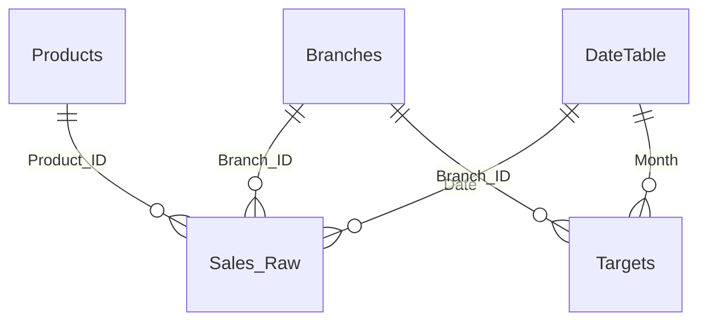

# Data model and dataset

This portfolio project is based on a **synthetic retail-sales dataset** representing **45 illustrative branches in Jeddah** over **June–August 2026**. It is not a report of actual employer sales or actual branch performance.

## Source dataset

The working workbook was named `Jeddah_Retail_Sales_Synthetic_3M.xlsx`. The available source worksheets and model structure include:

| Table | Purpose |
|---|---|
| `Sales_Raw` | Transaction-level sales lines, dates, branch/product references, quantities, discounts, sales amount and transaction IDs |
| `Branches` | Branch identifiers and descriptive attributes |
| `Products` | Product identifiers and category details |
| `Targets` | Monthly sales goals per illustrative branch |
| `DateTable` | Calendar table used for date-based filtering and comparisons in Power BI |

The date table may be created in Power BI rather than supplied as a workbook sheet. An optional `Branch Performance` table is also referenced in the supplied report visuals.

## Modeling approach

The report uses a fact/dimension-style structure: transaction rows in `Sales_Raw` are analyzed by date, branch and product, with monthly targets supporting target achievement measures where implemented.

Example relationship intentions for a reproducible model:

This is a **conceptual overview** for the portfolio, not an exported screenshot of the precise Power BI relationship configuration. Check key uniqueness, relationship directions and calendar grain when rebuilding or adapting the model.

## Publication note

If you reuse the dataset, retain its synthetic label. The workbook and editable PBIX may be uploaded to this repository only after reviewing source paths, report labels, embedded assets and any employer-identifying details.
